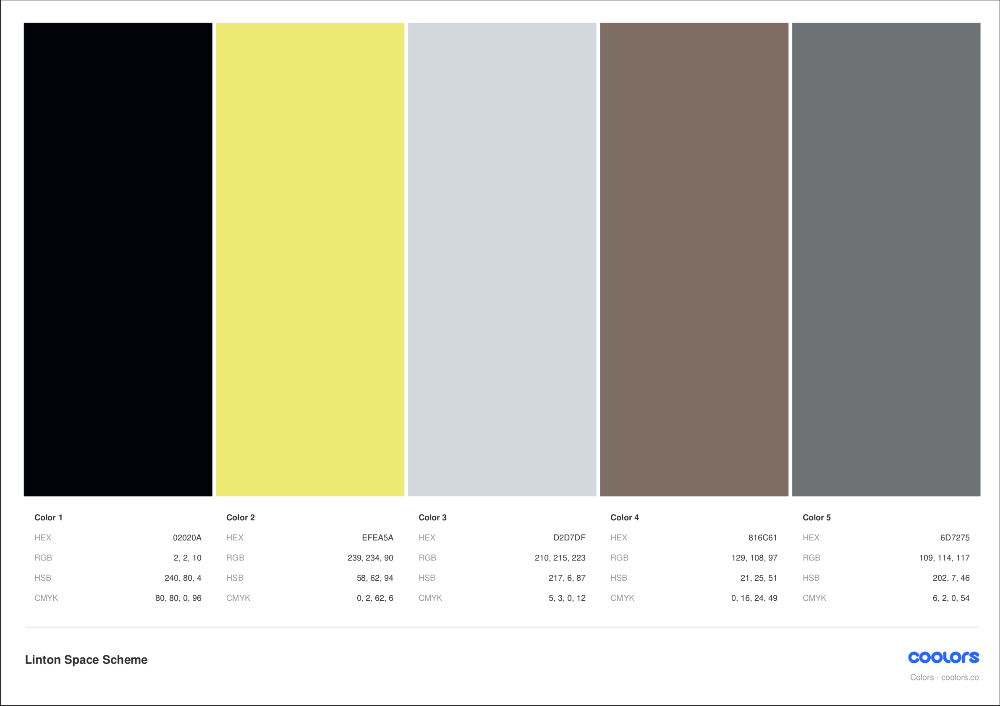
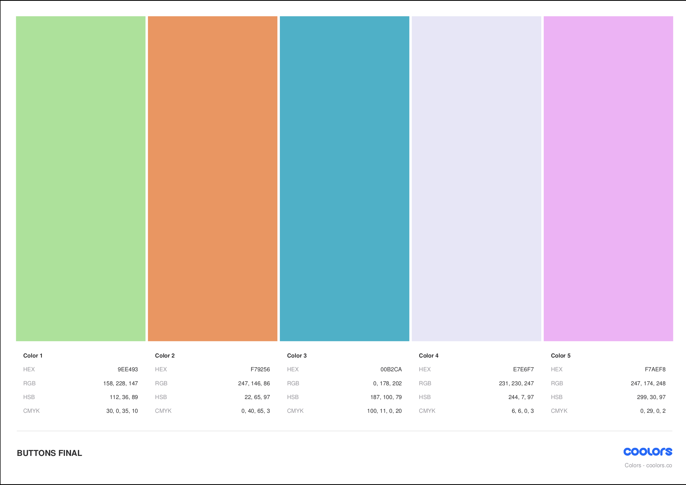

# Linton's Lights Memory Game

#### Code Institute Full Stack Development Dipoloma: Milestone Project 2 - Interactive Frontend Development 
##### Created by William Donovan

# Table of Contents 

1. [UX Development](#uxdev)
   - Project Manifesto and Aim
   - Player Goals
   - Educational Goals
   - Parental Goals
   - Developer and Business goals
   - User Stories 
   - Design Principles 
     * Fonts
     * Icons
     * Colours
   - Sitemap and Wireframes
   - Features and Future Implementations 
2. [Testing](#testing)
   - Jasmine Testing 
   - Game Testing
   - HTML and CSS checks using WC3 
   - User Testing
   - Peer Code Review
   - Automatic Tests
3. [Bugs and De-bugging](#bugs)
   - Known bugs
   - Solutions 
4. [Technologies Used](#Languages)
   - Languages Utilised
   - Online Material
   - Tools and Databases Used
5. [Project Deployment](#deployment)
   - Process of Deployment
   - How to create local version
6. [References](#References)
7. [Acknowledgements](#acknowledge)

# UX Development 

### Project Manifesto and Aim

During the COVID-19 pandemic nearly every aspect of life has been affected. One sector in particular that has caused controversy and unrest is education. 
The decision over schooling has once again turned domestic as children of all ages are made to work at home. 

My aim for the web application is to create a fun, interactive game that encourages cognitive development. Hopefully the contextual story of the game will make it 
more enaging as my goal is to target children between the ages of 9-13. Giving them something still educational but more aligned with how this generation process information.

This game is aimed to help parents too. Keeping the children engaged outside of school work will help eleveate their need to waste valuable work time.

### Player Goals

   - Fun story game to Play
   - Child Friendly characters (Linton)
   - Simple design and big buttons for easy Play
   - Diffiuclty tiers for engaging challenges
   - Visual and Audio rewards during the game
   - Completion banner as reward

### Educational Goals

   - Brain Training using memory receptors 
   - Help with non-verbal reasoning 
   - Linton's rules will be readable for this age group, aid with language learning
   - User name input, help with spelling

### Parental Goals 

   - Easy to use system
   - Child friendly Material
   - Wholesome intrinsic message to help save the world
   - Simple rules 

### Developer and Business Goals

   - Create sprite character for use in follow up games
   - Intuitive and easy design 

# User Stories

1. As a user between the ages 9-15, I want a game that:
   - Has an underlying fun story masked in as the game
   - Something to do in between school work
   - Characters to attach to
   - Bright but engaging colour scheme 
   - Easy to read but dramatiuc language 
   - Different difficulties and levels for competition

2. As a parent, I would like a game for my child that:
   - Keeps their brains stimulated but helps learning development
   - Appropriate context and Language
   - Easy to teach design and layout 
   - Something engaging incase I need to work late or I'm busy working from homne

# Design Principles

## Fonts

1. Title 

   For this I chose the google font **Hachi Maru Pop**. It has a Pixar-esque feel with the 'i' symbolising a light. Below is an example of the title font:

   

2. Linton's rules

   For the pop up rules message, I wanted a more retro and original game style, similar to the read messages from Pokemon.
   The font I decided on was **Source Code Pro** due to computer/lost in space feel. Below is an example of the message font:

   

    The **Source Code Pro** will also be used on the homepage for user input, start button and any other needed text.

## Icons

1. Linton

    I wanted to create a character that could live through multiple game settings and that character is called Linton.
    In this scenario, Linton is an Astronaut because I felt it would appeal to the target age group/audience. 
    
    Astronauts have an intrinsically positive message when it comes to the Earth. 
    They are either known for saving it, exploring it and never wanting to hurt it. With the COVID-19 and environmental issues we face in the 21st Century, I thought this choice would naturally help spread positivity about the Earth.

    

2. Spaceship

    For context, I chose this spaceship for the user to save. As a feature, when you complete the game, after
    Linton says congratulations, the rocket will fly across the screen:

    

## Colours

The colour scheme for this web application is comprised of two palettes: Space | Buttons.
I used [Coloors](https://coolors.co/), an online colour palette generator for cohesive, thoughtful and bold colours to match the game.

### Space

### Buttons

# Sitemap | Wireframes

